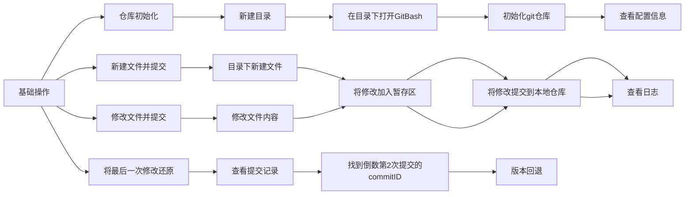
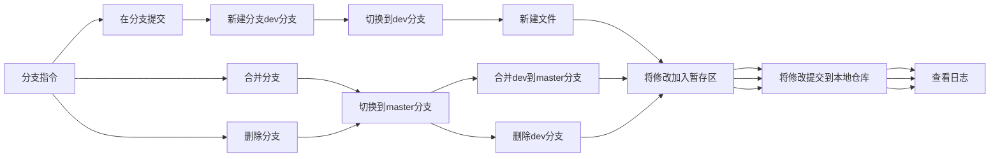
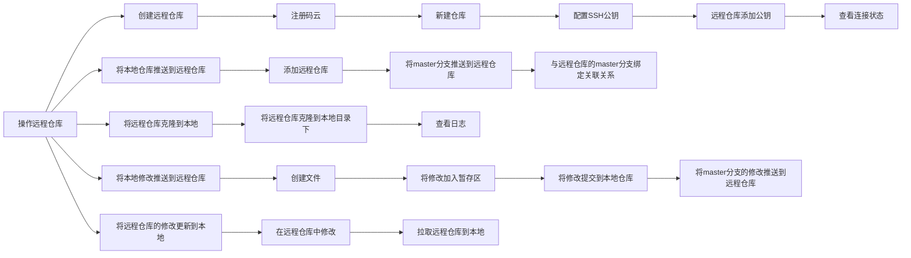

# 一、概述

## 1. Git是什么

定义：**版本管理工具**
特性：
1. 能够记录历史版本,回退历史版本
2. 团队开发,方便代码合并

## 2. Git的应用

> 场景一：**备份** 
> 
> 小明负责的模块就要完成了，就在即将Release之前的一瞬间，电脑突然蓝屏，硬盘光荣牺牲！几个月 来的努力付之东流 
---
> 场景二：**代码还原** 
> 
> 这个项目中需要一个很复杂的功能，老王摸索了一个星期终于有眉目了，可是这被改得面目全非的 代码已经回不到从前了。什么地方能买到哆啦A梦的时光机啊？ 
---
> 场景三：**协同开发**
>  
> 小刚和小强先后从文件服务器上下载了同一个文件：Analysis.java。小刚在Analysis.java 文件中的第30行声明了一个方法，叫count()，先保存到了文件服务器上；小强在Analysis.java文件中的 第50行声明了一个方法，叫sum()，也随后保存到了文件服务器上，于是，count()方法就只存在于小刚的记 忆中了 
---
> 场景四：**追溯问题代码的编写人和编写时间**
> 
> 老王是另一位项目经理，每次因为项目进度挨骂之后，他都不知道该扣哪个程序员的工资！就拿这 次来说吧，有个Bug调试了30多个小时才知道是因为相关属性没有在应用初始化时赋值！可是二胖、王东、刘流和正经牛都不承认是自己干的！

## 3. Git的工作流程

### 3.1 流程图


### 3.2 企业中的开发

1) 入职第一天，管理人员分配/git账号密码 
2) 开发人员下载代码文档，根据文档搭建环境
3) 公司团队给予项目相关支持
4) 接到第一个功能需求
5) 创建feature分支
6) 根据开发需求，进行本地测试
7) 提交代码到当前需求对应的feature分支
8) 合并分支至test分支，测试人员会在test分支中测试
9) 测试人员测试bug ，开发者在feature分支上继续修、提交
10) 测试人员测试通过 ，test分支会被测试人员合并到develop开发分支，再次测试
11) develop分支最终会被合并到master主分支

> 一个需求对应一个feature，id需要标注该需求

---

为了避免将测试代码提交,需要提交前,检查如下步骤

- 是否多提交了某个文件，比如测试文件
- 是否漏提交文件
- 打开每一个应该提交的文件,判断是否多提交了一行代码,是否少提交了一行代码,是否删除了本应该存在的代码
- 检查完毕提交代码


# 二、Git环境配置

## 1.Git下载

官网入口：[Git官网](https://git-scm.com/download)

> Git GUI：Git提供的图形界面工具 
> Git Bash：Git提供的命令行工具


## 2.基本配置


| 指令                                                                            | 操作                   |
| ------------------------------------------------------------------------------- | ---------------------- |
| git init                                                                        | 新建.git文件           |
| git config --global user.name "用户名"<br>git config --global user.email "邮箱" | 设置用户名<br>设置邮箱 |
| git config --global user.name<br>git config --global user.email |查看用户名<br>查看邮箱|


## 3.配置别名

1.在用户目录下，创建.bashrc 文件

```
touch ~/.bashrc
vi .bashrc
```


2.在 .bashrc 文件中输入

```
#用于输出git提交日志 
alias git-log='git log --pretty=oneline --all --graph --abbrev-commit' 
#用于输出当前目录所有文件及基本信息 
alias ll='ls -al'
```


3.打开gitBash，执行 .bashrc
```
source ~/.bashrc
```


# 三、Git的基本操作

## 1.基础指令

状态转换:
1. git add (工作区 --> 暂存区)
2. git commit (暂存区 --> 本地仓库)

| 指令                                                   | 作用                               |
| ------------------------------------------------------ | ---------------------------------- |
| ls/ll                                                  | 查看当前目录                       |
| cat                                                    | 查看文件内容                       |
| touch                                                  | 创建文件                           |
| vi                                                     | vi编辑器                           |
| git status                                             | 查看修改的状态(暂存区、工作区)     |
| git add 文件名/通配符                                  | 添加工作区文件的修改到暂存区       |
| git commit -m ‘注释内容’                               | 提交暂存区内容到本地仓库的当前分支 |
| git reset --hard commitID                              | 版本切换                           |
| git reflog                                              | 查看已经删除的记录                 |
| git log                                                | 查看简化日志                       |
| git log --pretty=oneline --all --graph --abbrev-commit | 查看简化日志                       |

### 1.1详细步骤

#### 文字说明



#### 代码实现

##### touch


---
##### git add /  git status


---
##### git commit -m


---
##### git log


---
##### git reset --hard


---
##### git reflog


### 1.2忽略文件

.gitignore内容

```
# Created by .ignore support plugin(hsz.mobi)  
### Java template  
*.class  
  
# Mobile Tools for java(J2ME)  
.mtj.tmp/  
  
# Package Files  
*.jar  
*.war  
*.ear  
*.zip  
  
#virtual machine crash logs,see http://www.java.com/en/download/help/error_hotspot.xml  
hs_err_pid*  
  
.idea  
  
*.iml*.bak  
*.class  
*.rar  
*.log  
*.project  
*.settings  
*.classpath  
target  
classes  
lib  
*.DS_Store  
.gradle  
build  
out  
log
```

## 2.分支指令

| 指令                                 | 作用                                                 |
| ------------------------------------ | ---------------------------------------------------- |
| git branch                           | 查看本地分支                                         |
| git branch 分支名                    | 创建本地分支                                         |
| git checkout 分支名                  | 切换分支                                             |
| git checkout -b 分支名               | 创建并切换分支                                       |
| git merge 分支名                   | 合并分支                                             |
| git branch -d 分支名<br>git branch -D 分支名| 删除分支时，需要做各种检查<br>不做任何检查，强制删除 |

### 2.1详细指令 

#### 文字说明



#### 代码实现

#### git banch  / git branch xxx


---
#### git checkout


---
#### git checkout -b


---
#### git merge


---
#### git branch -d


### 2.2解决冲突

冲突原因：同时修改了同一个文件的同一行

解决方法：

1. 处理文件中冲突的地方
2. 将解决完冲突的文件加入暂存区
3. 提交到仓库
---


### 2.3分支使用原则及流程

| 概念                 | 解释                                                                                                                                                             |
| -------------------- | ---------------------------------------------------------------------------------------------------------------------------------------------------------------- |
| master生产分支 | 主分支，中小规模项目作为线上运行的应用对应的分支                                                                                                       |
| develop开发分支   | 从master创建的分支，一般作为开发部门的主要开发分支，阶段开发完成后，需要合并到master分支上 |
| feature分支     | 从develop创建的分支，一般是同期并行开发，但不同期上线时创建的分支，分支上的研发任务完 成后合并到develop分支                                                      |
| hotfix分支       | 从master派生的分支，一般作为线上bug修复使用，修复完成后需要合并到master、test、 develop分支                                                                      |


### 2.4强制删除场景


### 2.5快进模式


# 四、远程仓库

## 1.常用仓库

[gitHub](https://github.com/ )

[码云](https://gitee.com/ )

[GitLab](https://about.gitlab.com/ )

## 2.创建远程仓库


### 2.1注册码云


### 2.2新建仓库


### 2.3配置SSH公钥

```
ssh-keygen -t rsa //生成SSH公钥
cat ~/.ssh/id_rsa.pub //获取公钥
ssh -T git@gitee.com //验证是否配置成功
```


## 3.操作远程仓库

| 指令                                                                              | 作用                                                                                           |
| --------------------------------------------------------------------------------- | ---------------------------------------------------------------------------------------------- |
| git remote add <远端名称> <仓库路径>                                              | 先初始化本地库，然后与已创建的远程库进行对接                                                   |
| git remote                                                                        | 查看远程仓库                                                                                   |
| git push[option]<远端名称><本地分支名><:远端分支名><br> -f<br> --set-upstream     | 推送到远程仓库<br> 强制覆盖<br> 推送到远端并建立和远端分支的关联关系                           |
| git branch -vv                                                                    | 查看关联关系                                                                                   |
| git clone <仓库路径><本地目录>                                                    | 从远程仓库克隆                                                                                 |
| git fetch [remote name] [branch name]                                             | 抓取（将仓库里的更新都抓取到本地，不会进行合并）                                               |
| git pull [remote name] [branch name]                                              | 拉取（将远端仓库的修改拉到本地并自动进行合并）                                                 |
| git config --global core.autocrlf true<br>git config --global core.autocrlf input | Windows系统下在提交代码时自动将LF转换为CRLF<br>Linux/macOS系统下在提交代码时自动将CRLF转换为LF |


如果远程分支名和本地分支名称相同，则可以只写本地分支
如果当前分支已经和远端分支关联 ，则可以省略分支名和远端名
如果已经有一个远端仓库，我们可以直接clone到本地，本地目录可以省略，会自动生成一个目录

### 3.1详细指令

#### 文字说明



#### 代码实现

##### git remote add / git remote / git push


---
##### git push --set-upstream  / git branch -vv


---
##### git clone

克隆前（本地文件）

克隆后（抓取的文件）


---
##### git fetch 


---
##### git pull = git push +git merge


### 3.2合并冲突


---
本地仓库修改上传

克隆仓库修改上传

上传后产生冲突

克隆仓库修改后重新上传

本地仓库重新拉取


