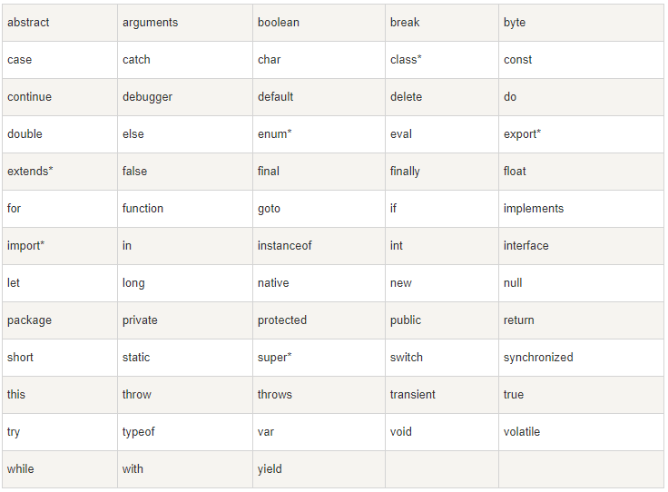

# 入门

## 一、简介

### 1.定义

JavaScript 是一种脚本语言，是一种动态语言，是一种解释型语言，是一种弱类型语言，是一种跨平台语言

### 2.作用

- 网页特效 (监听用户的一些行为让网页作出对应的反馈) 
- 表单验证 (针对表单数据的合法性进行判断)
- 数据交互 (获取后台的数据, 渲染到前端) 
- 服务端编程 (node.js)

### 3.分类

- ECMAScript（规定了js基础语法核心知识）
- DOM（操作文档）
- BOM（操作浏览器）

## 二、引入方式

### 1.内嵌式

```
<script>
	
</script>
```

### 2.外链式

` <script src="js/test.js"></script>`

### 3.行内式

`<a href="javascript:alert('单击超链接')">点击这里</a>`

> 注意：`<script>`放在`<body>`标签底部可以降低页面下载的影响

# 语法

## 一、变量

### 1.定义
| 名称  | 作用                                 |
| ----- | ------------------------------------ |
| 变量  | 变量是存储数据的容器                 |
| 数组  | 存储多个数据的容器                   |
| const | 常量，不允许重新赋值                 |
| let   | 块级作用域，只在{}中有效，不支持重名 |
| var   | 全局作用域，支持重名，不建议使用     |
### 2.标识符

- 只能是字母、数字、下划线、$，且不能能数字开头
- 字母区分大小写
- 关键字或保留字不允许使用
- 保证变量的可读性

### 3.关键字

#### 保留关键字



#### `let` 和 `var`

| 能否               | var  | let  |
| ------------------ | ---- | ---- |
| 声明并赋值         | √    | √    |
| 重复声明           | √    | ×    |
| 声明多个变量并赋值 | √    | √    |
## 二、数据类型

### 1.基本数据类型

| 数据类型 |           |                  |
| -------- | --------- | ---------------- |
| 字符串型 | string    | 单双反引号包裹   |
| 数值型   | number    | 正数、负数、小数 |
| 布尔型   | boolean   | true、false      |
| 未定义型 | undefined | 只声明，未赋值   |
| 空       | null      | 有值为空         |

#### 分类

- 基本数据类型
  - number 数字型
  - string 字符串型
  - boolean 布尔型
  - undefined 未定义型
  - null 空类型
- 引用数据类型
  - Object

#### undefined和null的区别

undefined是只声明，不赋值，说明值没传过来
null是赋值了，但值为空，说明还不知到放什么，先放个null

#### 注意

- 顺序执行，分号可无
- 大小写敏感
- 空格省略，换行断句
- typeof 关键字检测数据类型
- 乘、除、取余优先级大于加、减
- 加号，数字相加，字符相连
#### 模板字符串

```
`${}`
```
### 2.数据类型检测

#### typeof

```javascript
let num = 2
console.log(typeof num) // number
```

#### 对象原型扩展函

```javascript
let data = null
let type = "Null" // 数据类型
console.log(Object.prototype.toString.call(data)) // [object Null]
Object.prototype.toString.call(data) == '[object '+type+']' //true
```

### 3.数据类型转换

#### 转布尔

```
Blooean()
```

| 转换前     | 转换后 |
| ---------- | ------ |
| 非空字符串 | true   |
| 非零数值   | true   |
| 空字符串   | false  |
| NaN        | false  |
| 0          | false  |
| undefined  | false  |
| null       | false  |

#### 转数值

```
Number() //数值型
parseInt() //整型
parseFloat() //浮点型
isNaN() //判断是否为数值型
```

| 转换前    | Number() | parseInt() | parseFloat() |
| --------- | -------- | ---------- | ------------ |
| "123"     | 123      | 123        | 123          |
| " "       | 0        | NaN        | NaN          |
| "2abc1"   | NaN      | 2          | 2            |
| "abc"     | NaN      | NaN        | NaN          |
| null      | 0        | NaN        | NaN          |
| undefined | NaN      | NaN        | NaN          |
| false     | 0        | NaN        | NaN          |
| true      | 1        | NaN        | NaN          |

#### 转字符

```
String() //全都可以转
toString() //null和undefined不能转
```


## 三、运算符

### 1.算数运算符

### 2.字符串运算符

### 3.赋值运算符

### 4.比较运算符

### 5.逻辑运算符

### 6.三元运算符

### 7.位运算符
| 运算符 | 运算       |
| ------ | ---------- |
| &      | 按位与     |
| \|     | 按位或     |
| ~      | 取反       |
| ^      | 按位异或   |
| <<     | 左移       |
| >>     | 右移       |
| >>>    | 无符号右移 |

### 8.运算符优先级

先括号，再乘除取余，后加减

## 四、流程控制

### 1.if语句

### 2.if···else语句

###  3.switch语句

### 4.while循环

### 5.do···while循环

### 6.for循环

### 7.循环嵌套

# 数组

## 一、基本操作

### 1.数组定义

**作用**：存储一组变量
**取值**：数组名\[下标]
**元素**：数组中保存的每个数据都叫数组元素
**下标**：数组中数据的编号
**长度**：数组中数据的个数，通过数组的length属性获得

### 2.创建数组

```
var 数组名 = new Array()
var 数组名 = [ ]
```

```
  var arr = new Array(123, 'abc', null, ,true, undefined)
  var arr = [123, 'abc', null, ,true, undefined]
```

### 3.获取长度

```
.length
```

```
var arr1 = [78, 88, 98];
console.log(arr1.length);   // 输出结果为：3
```

### 4.遍历数组

for in 循环

```
var navlistArr = ['首页','新闻','关于'];
var str = '<ul>';
for(var i in navlistArr){
    str += '<li><a>'+ navlistArr[i] +'</a></li>';
}
str += '</ul>';
document.getElementById('navlist').innerHTML = str;
```

### 5.增加元素

```
// 为空数组添加元素
var height = [];
height[5] =  183;
height[0] =  175;
height[3] =  150;
console.log(height);      // 输出结果：(6) [175, empty × 2, 150, empty, 183]

// 为非空数组添加元素
var arr = ['Asa', 'Taylor'];
arr[2] = 'Tom';
arr[3] =  'Jack';
console.log(arr);         // 输出结果：(4) ["Asa", "Taylor", "Tom", "Jack"]
```

### 6.删除元素

删除后依旧占用空间

```
var stu = ['Tom', 'Jimmy', 'Lucy'];
console.log(stu);     // 输出结果：(3) ["Tom", "Jimmy", "Lucy"]
delete stu[1];        // 删除数组中第2个元素
console.log(stu);     // 输出结果：(3) ["Tom", empty, "Lucy"]
```

### 7.修改元素

```
var arr = ['a', 'b', 'c', 'd'];
arr[2] = 123;
arr[3] = 456;
console.log(arr);         // 输出结果：(4) ["a", "b", 123, 456]
```

#### 解构赋值

```
// 传统方式
var arr = [1, 2, 3];
var a = arr[0];
var b = arr[1];
var c = arr[2];
```

```
// ES6解构赋值
var n1 = 4
var n2 = 8;
[n1, n2] = [n2, n1];
```


### 8.查找数组

```
var arr = ['hello', 'JavaScript', 22.48, true];
console.log(arr[0]);
console.log(arr[2]);
console.log(arr);
```

## 二、二维数组

### 1.创建数组

```
var 数组名 = new Array(new Array(),new Array())
var 数组名 = [[],[]]
```

```javascript
var arr = new Array(new Array(12,59,66),new Array(212,32))
var arr = [[12,59,66],[212,32]]
```

### 2.遍历数组

```javascript
var arr = [[12,59,66],[212,32]]
var sum = 0
for(let i in arr){
	for(let j in arr[i]){
		sum += arr[i][j]
	}
}
console.log(sum) // 381
```

### 3.数组转置

```javascript
var arr = [[1,2,3],[4,5,6],[7,8,9],[10,11,12]]
console.log("转置前",arr)
/*
[
	[1,2,3],
	[4,5,6],
	[7,8,9],
	[10,11,12]
]
*/
//定义空数组存放转置后的值
var res = []
for(i=0;i<arr[i].length;i++){
    //获取层数
    res[i] = []
	for(j=0;j<arr.length;j++){
        //交换位置
		res[i][j]=arr[j][i]
    }
}
console.log("转置后",res)
/*
[
	[1, 4, 7, 10]
	[2, 5, 8, 11]
	[3, 6, 9, 12]
]
*/
```


## 三、数组排序


### 1.冒泡排序

```javascript
var arr = [12,56,2,11,23,101,64]
for(i=1;i<arr.length;i++){
	for(j=0;j<arr.length-i;j++){
		if(arr[j]>arr[j+1]){
            var temp = arr[j]
            arr[j] = arr[j+1]
            arr[j+1] = temp
		}
    }
}
console.log(arr) // [2, 11, 12, 23, 56, 64, 101]
```

### 2.插入排序


### 3.快速排序


### 4.选择排序


### 5.希尔排序


### 6.归并排序


### 7.堆排序


### 8.桶排序


### 10.计数排序


## 四、数组方法

### 1.栈和队列

| 方法      | 功能               |
| --------- | ------------------ |
| push()    | 向数组尾部添加元素 |
| pop()     | 删除数组尾部元素   |
| shift()   | 删除数组头部元素   |
| unshift() | 向数组头部添加元素 |

### 2.检索方法

| 方法            | 功能                         |
| --------------- | ---------------------------- |
| includes()      | 判断数组是否包含某个元素     |
| Array.isArray() | 判断是否为数组               |
| indexOf()       | 查找数组中第一个该元素位置   |
| lastIndexOf()   | 查找数组中最后一个该元素位置 |

### 3.数组转字符串
| 方法              | 功能                     |
| ----------------- | ------------------------ |
| join()            | 将数组元素连接成字符串   |
| toString()|  返回一个字符串|

### 4.数据过滤
| 方法              | 功能                     |
| ----------------- | ------------------------ |
| filter()          | 过滤数组                 |
#### 直接修改数组

```javascript
//筛选出偶数
const arr = [3,4,5,6,7,8]
const arr2 = arr.filter(number => number %2 == 0)
console.log(arr2) // [4,6,8]
```

#### 数据筛选

```javascript
//筛选高价值客户
//过去一年内消费总额超过10000元或订单数量超过10个的高价值客户
/*
customers:客人数组
id:唯一id
name：客人名称
orders:订单数组
amount:金额
date:日期
*/
const customers = [
  { id: 1, name: '张三', orders: [
    { amount: 1200, date: '2023-05-15' },
    { amount: 2500, date: '2023-07-22' },
    { amount: 1800, date: '2023-08-05' }
  ]},
  { id: 2, name: '李四', orders: [
    { amount: 9000, date: '2023-03-01' },
    { amount: 2200, date: '2023-09-12' }
  ]},
  { id: 3, name: '王五', orders: [
    { amount: 750, date: '2023-02-17' },
    { amount: 1100, date: '2023-04-03' },
    { amount: 1500, date: '2023-05-09' },
    { amount: 1300, date: '2023-06-21' }
  ]},
  { id: 4, name: '赵六', orders: [
    { amount: 2000, date: '2023-01-05' },
    { amount: 1700, date: '2023-02-20' },
    { amount: 2300, date: '2023-03-18' }
  ]},
  { id: 5, name: '孙七', orders: [
    { amount: 3500, date: '2023-04-08' },
    { amount: 4200, date: '2023-05-22' }
  ]},
  { id: 6, name: '老八', orders: [
    { amount: 550, date: '2023-03-02' },
    { amount: 850, date: '2023-08-16' }
  ]},
];

const highCustomer = customers.filter(people => { //从customers数组中筛选具体的对象
	const cost =people.orders.reduce((sum,times) => { //将上述对象中的orders中的amount累加
		const orderDate = new Date(times.date) //获取订单时间
        const currentDate = new Date() //获取当前日期 2025-1-6
        currentDate.setFullYear(currentDate.getFullYear() -2) 
        // getFullYear()获取当前时间 2025，setFullYear()设置当前时间 2025
        return sum + (orderDate >= currentDate ? times.amount : 0)
    },0) // 初始值为0，从0开始相加
    return cost >= 10000 || people.orders.length >10
})
 
console.log(highCustomer); 
/*
{ id: 2, name: '李四', orders: [
    { amount: 9000, date: '2023-03-01' },
    { amount: 2200, date: '2023-09-12' }
  ]}
*/
```

#### 数据清洗


#### 数据过滤


### 5.其他方法


| 方法              | 功能                     |
| ----------------- | ------------------------ |
| reverse()         | 反转数组                 |
| sort()            | 对数组元素进行排序       |
| concat()          | 连接两个数组             |
| slice()           | 截取数组                 |
| splice()          | 删除数组元素             |
| forEach()         | 遍历数组                 |
| map()             | 映射数组                 |
| every()           | 判断数组元素是否满足条件 |
| some()            | 判断数组元素是否满足条件 |
| reduce()          | 数组元素累加             |
| reduceRight()     | 数组元素累加             |
| find()            | 查找数组元素             |
| findIndex()       | 查找数组元素位置         |
| fill()            | 填充数组                 |
| entries()         | 返回数组元素键值对       |
| keys()            | 返回数组元素键名         |
| values()          | 返回数组元素键值         |
| Symbol.iterator() | 返回数组迭代器           |
| Array.from()      | 将类数组对象转换为数组   |
| Array.of()        | 将一组值转换为数组       |


# 函数

## 一、定义与调用

### 1.定义

```
function 函数名(参数1,参数2,...){
    函数体
}
```

### 2.参数

#### 无参函数

```javascript
function greet(){
	console.log("Hello");
}
```

#### 有参函数

```javascript
function max(a,b){
	return a>b?a:b;
}
max(5,9) // 9
```

#### 剩余参数

```
function 函数名(...参数){
    函数体
}
```
```javascript
function add(...theNums) {
    let sum = 0;
    for (let num of theNums) {
        sum += num;
    }
    return sum;
}
console.log(add(3, 7, 9, 15,66)); 
```
## 二、作用域

函数是一个基本作用域

### 1.全局变量

函数外声明或函数内隐式声明的变量

### 2.局部变量

函数内用var声明的变量

### 3.块级变量

块级变量：let声明的变量，只在{}中有效

```javascript
var str = '123' //全局变量
function test(){
	var str2 = '234' //局部变量
    for(let i = 0;i<3;i++){ //块级变量
		console.log(i)
    }
}
```

### 4.垃圾回收

函数执行后，销毁局部变量，可以使用全局变量保存和return返回来保存

## 匿名函数

没有名字的函数

## 箭头函数

函数名 = 参数 => 返回值

## 回调函数

| 方法          | 功能                                               |
| ------------- | -------------------------------------------------- |
| find()        | 返回满足的第一个条件的元素                         |
| every()       | 判断是否所有元素都满足条件                         |
| some()        | 判断是否有元素满足条件                             |
| forEach()     | 遍历数组                                           |
| map()         | 返回一个新数组，元素是原数组元素调用函数处理后的值 |
| reduce()      | 对数组元素进行计算，返回一个值                     |
| reduceRight() | 从右向左计算                                       |

## 函数嵌套

函数可以嵌套，嵌套的函数可以访问外层函数的变量，但是不能访问内层函数的变量

## 作用域链

函数执行时，会创建一个作用域链，作用域链中包含当前作用域，当前作用域的父作用域，直到全局作用域
找不到就返回上一层找，直到找到为止 

## 闭包函数

1. 函数外部访问函数内的变量
2. 变量的值保存在内存中，不能被修改

# 对象

### 特性

封装性：隐藏细节，开放接口
继承性：继承另一个对象的成员
多态性：同一操作对不同对象，产生的结果不同

### 定义对象

`var obj = {}`

```
var obj = obj{
    name:"zhangsan",
    age:18,
}
```

### JSON

```
{
    "name":"zhangsan",
    "age":18
}
```

### 访问对象成员

```
var obj = {
    name:"zhangsan",
    age:18
}
console.log(obj.name)
var introduce = function(){
    console.log("my name")
}
```

### 遍历对象

for ··· in

```
var obj ={
    name:"zhangsan",
    age:18
}
for(var k in obj){
    console.log(k,obj[k])
}
```

### 对象是否存在

```
var obj= {
    name:"zhangsan",
    age:18
}
console.log('name' in obj)
console.log('sex' in obj)
```

### 深浅拷贝

浅拷贝：复制后相同,改一个变两个，节省内存 

```
var obj ={
    name:"zhangsan",
    age:18
}
var obj2 = obj
obj2.name = "lisi"
console.log(obj === obj2)

```

深拷贝：复制后不同，改一个不影响另一个

```
var obj ={
    name:"zhangsan",
    age:18
}
var obj2 = function(obj){
    for(i in obj){
        obj2[i] = obj[i]
    }
}
obj2.name = "lisi"
console.log(obj === obj2)
```

### 构造函数

构造函数：创建相同特征的对象

```
function factory(name,age){
    var o = {}
    o.name = name
    o.age = age
}
o1 = factory("lisi",24)
o2 = factory("wangwu",25)
console.log(o1)
console.log(o2)
```

类：

实例化：通过类创建对象的过程

内置构造函数：

`{}.constructor`

[native code]表示是原生代码

```
var obj = new Object()
var str = new String("123")
console.log(obj.constructor)
console.log(str.constructor)
```

### 自定义构造函数

1. 帕斯卡命名法：首写字母大写
2. 使用this指向实例化对象

```
function Person(name,age){
    this.name = name;
    this.age = age;
    this.sayHello = function(){
        console.log("Hello,my name is "+ this.name)
    }
}
var p1 = new Person("zhangsan",18)
var p2 = new Person("lisi",20)
p1.sayHello()
console.log(p1)
p2.sayHello()
console.log(p2)
```

### class关键字

```
class Person{
    constructor(name,age){
        this.name = name
        this.age = age
    }
    introduce(){
        console.log('我是' + this.name + ',今年'+this.age + '岁')
    }
}
var p = new Person("zhangsan",18)
p.introduce()
console.log(p)
```

### 私有成员

私有成员:构造函数中用var定义的成员

```
function Person(){
    var name = "zhangsan"
    this.getName = function(){
        return name
    }
}
var p = new Person()
console.log(p.name)
console.log(p.getName())
```

### return 关键字

return + 基本类型 = 数据
return +引用类型 = 对象

```
//返回基本数据类型
function Person(){
    obj =this
    return 123
}
var obj,p= new Person()
console.log(obj === p)
//返回引用数据类型
function Person2(){
    obj2 = this
    return {}
}
var obj2,p2 = new Person2()
console.log(obj2 === p2)
```

### this

1. 指向构造函数内部对象
2. 直接调用函数调用全局对象
3. 对象的方法，指向对象

```
function obj(){
    return this
}
var o ={
    name :"zhangsan",
    function:obj
}
console.log(obj() == window)
console.log(o.function() === o)
```

### 更改this指向

apply()
call()

```
function obj(){
    console.log(this.name)
}
obj.apply({name:'张三'})
obj.call({name:'李四'})
```

### String对象

| 方法          | 解释                 |
| ------------- | -------------------- |
| length        | 字符串长度           |
| charAt()      | 从0开始获取字符位置  |
| indexOf()     | 获取字符首次出现位置 |
| lastIndexOf() | 获取字符最后出现位置 |
| substr()      | 按位置截取字符串     |
| substring()   | 按长度截取字符串     |
| toLowerCase() | 转小写               |
| toUpperCase() | 转大写               |
| trim()        | 去除首尾空格         |
| replace()     | 替换字符串           |
| split()       | 分割字符串           |

## Number对象

| 方法      | 解释       |
| --------- | ---------- |
| MAX_VALUE | 最大值     |
| MIN_VALUE | 最小值     |
| toFixed() | 保留小数位 |

## date方法

| 方法          | 解释       |
| ------------- | ---------- |
| getFullYear() | 获取年份   |
| getMonth()    | 获取月份   |
| getDate()     | 获取日期   |
| getDay()      | 获取星期   |
| getHours()    | 获取小时   |
| getMinutes()  | 获取分钟   |
| getSeconds()  | 获取秒     |
| getTime()     | 获取时间戳 |
| setFullYear() | 设置年份   |
| setMonth()    | 设置月份   |
| setDate()     | 设置日期   |
| setHours()    | 设置小时   |
| setMinutes()  | 设置分钟   |
| setSeconds()  | 设置秒     |
| setTime()     | 设置时间戳 |

## Math对象

| 方法          | 解释     |
| ------------- | -------- |
| random()      | 随机数   |
| PI            | 圆周率   |
| abs()         | 绝对值   |
| ceil()        | 向上取整 |
| floor()       | 向下取整 |
| round()       | 四舍五入 |
| max           | 最大值   |
| min           | 最小值   |
| pow(exp,base) | 指数     |
| sqrt(num)     | 开方     |

## 错误处理

## 报错信息

### 语法错误

### 运行错误

## 常用语句

| 语句             | 功能                           |
| ---------------- | ------------------------------ |
| alert()          | 弹出对话框                     |
| console.log()    | 打印到控制台                   |
| prompt()         | 弹出对话框，返回用户输入的值   |
| confirm()        | 弹出对话框，返回用户点击的按钮 |
| setInterval()    | 定时器                         |
| setTimeout()     | 定时器                         |
| document.write() | 向页面写入内容                 |

| 类型           | 说明                   |
| -------------- | ---------------------- |
| Error          | 普通错误               |
| EvalError      | eval()函数错误         |
| RangeError     | 超出范围错误           |
| ReferenceError | 引用不存在的变量       |
| SyntaxError    | 解析过程语法错误       |
| TypeError      | 变量或参数不是预期类型 |

```
try {
  // 可能抛出错误的代码
} catch (error) {
  // 错误发生时执行的代码
  console.error('发生了一个错误:', error.message);
}
```

finally

关闭文件流：在文件操作完成后，确保文件流被关闭。
释放数据库连接：在数据库操作完成后，释放连接资源。
清理内存：在处理完需要大量内存的数据后，清理不再需要的内存。
注销事件监听器：在组件卸载时，注销所有注册的事件监听器。

## JSON

JSON.stringify() 方法

JSON.stringify() 方法用于将 JavaScript 值转换为 JSON 字符串。

## 原型和继承


# BOM

## BOM对象

- document 文档对象
- window 窗口对象
- location 位置对象
- history 历史对象
- navigator 浏览器对象
- screen 屏幕对象

## window对象


| 属性   | 说明                                   |
| ------ | -------------------------------------- |
| closed | 返回一个布尔值，该值指示窗口是否已关闭 |
| name   | 返回窗口的名称                         |
| opener | 返回window对象的引用                   |
| parent | 返回当前窗口的父窗口                   |
| self   | 返回当前窗口                           |
| top    | 返回最顶层的父窗口                     |


| 方法       | 说明                                         |
| ---------- | -------------------------------------------- |
| alert()    | 显示带有一段消息和一个确认按钮的警告框       |
| confirm()  | 显示带有一段消息和两个按钮的提示框           |
| prompt()   | 显示一个可提示用户输入的对话框               |
| open()     | 打开一个新的浏览器窗口或查找一个已命名的窗口 |
| close()    | 关闭当前窗口                                 |
| focus()    | 把键盘输入焦点移到当前窗口                   |
| print()    | 打印当前窗口的内容                           |
| scrollBy() | 指定像素值滚动当前窗口                       |
| scrollTo() | 指定坐标滚动当前窗口                         |

## 定时器


| 方法            | 说明                           |
| --------------- | ------------------------------ |
| setTimeout()    | 数毫秒后调用一个函数           |
| clearTimeout()  | 取消setTimeout()               |
| setInterval()   | 数毫秒后调用一个函数，重复执行 |
| clearInterval() | 取消setInterval()              |


## location对象


## history对象


## navigator对象


## screen对象

## DOM

文档对象是网页中所有对象的所有者

#### 定时器

轮循定时器

```
setInterval(function(){},1000)
```

延迟定时器

```
setTimeout(function(){},1000)
```

### 选择元素

```
//通过 id 找元素
document.getElementById(id) 

//通过 类 找元素
document.getElementsByClassName(name) 

//通过 标签 找元素
document.getElementsByTagName(name)
```

### 使用DOM

element.childNodes 返回一个元素的子节点的数组。

element.firstChild 返回元素的第一个子节点。

element.lastChild 返回元素的最后一个子节点。

element.hasChildNodes 如果元素有任何子节点，则返回 true，否则为 false 。

element.nextSibling 返回相同树级别的下一个节点。

element.previousSibling 返回在同一树级别的上一个节点。

element.parentNode 返回元素的父节点。

element.cloneNode() 克隆元素并返回结果节点。

document.createElement(element) 创建一个新的元素节点。

document.createTextNode(text) 创建一个新的文本节点。

element.appendChild(newNode) 将一个新的子节点添加到元素作为最后一个子节点。

element.insertBefore(node1, node2) 在节点2之前插入node1作为子节点。

要替换HTML元素，使用 element.replaceChild(newNode,oldNode) 方法
