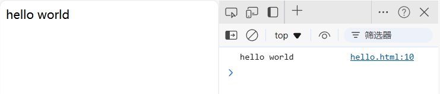
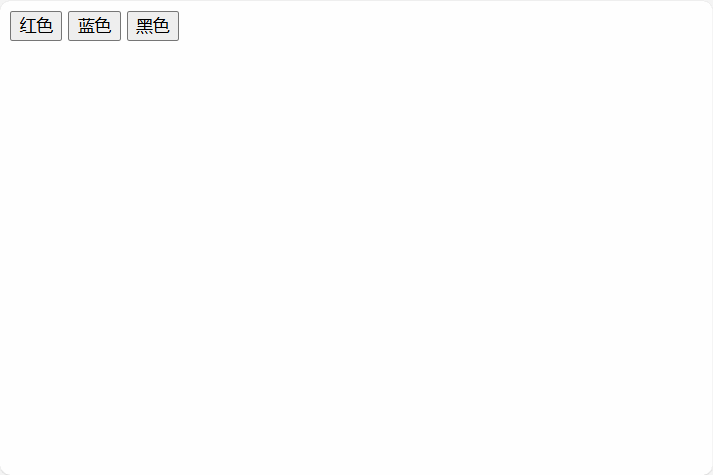
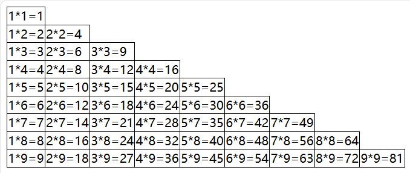
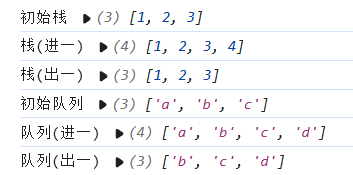
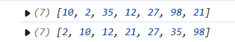
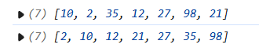
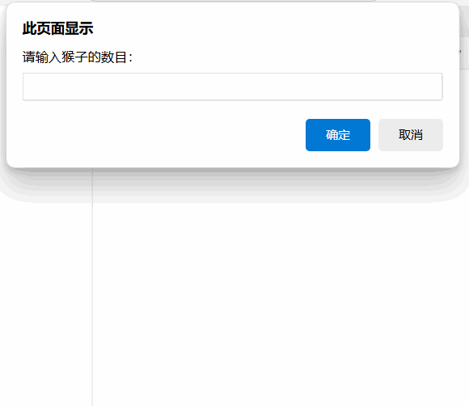
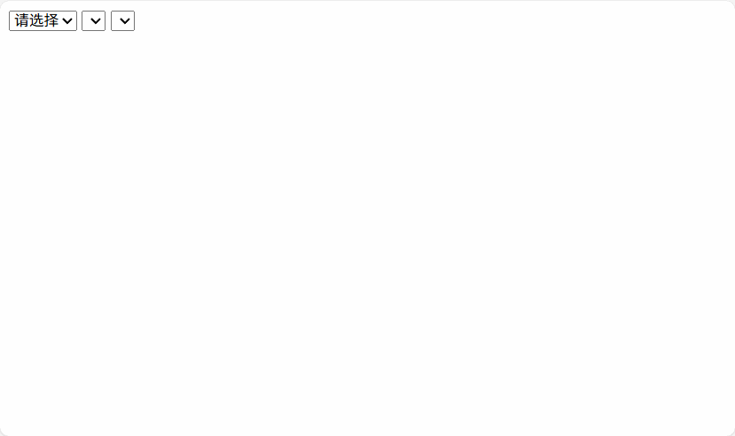
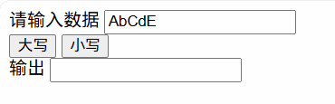

## 一、入门

### 1.输出Hello World

```
document.write('hello world') // 输出到页面
console.log('hello world') // 输出到控制台
```



### 2.背景转换

```
<input type="button" value="红色" onclick="changeColor('red')" />
<input type="button" value="蓝色" onclick="changeColor('blue')" />
<input type="button" value="黑色" onclick="changeColor('black')" />
```

```
function changeColor(str){
    document.body.style.backgroundColor = str;
}
```



## 二、语法

### 1.九九乘法表

```
<div id="table"></div>
```

```
table{
    border-collapse: collapse
}
td{
    border: 1px solid #000;
}
```

```
var str = '<table>';
for(var i = 1;i<10;i++){
    str += '<tr>';
    for(var j=1;j<=i;j++){
        str += `<td>${j}*${i}=${i*j}</td>`
    }
    str += '</tr>'
}
str +='</table>'
document.getElementById('table').innerHTML = str;
```



### 2.打印金字塔

用户输入一个数字，打印出对应层数的金字塔

```
var level = prompt('请输入金字塔层数：');
// 判断是否为数字
level = parseFloat(level) && Number(level);
//判断输入是否合法
if(isNaN(level) || level <= 0){
    alert('金字塔的层数必须是正整数')
};
//遍历金子塔层数
for(var i = 1;i <= level;i++){
    //打印空格
    var blank = level -i;
    for(var j=1;j<=blank;j++){
        document.write('&nbsp;')            
    }
    //打印星星
    var star = 2*i-1
    for(var k=1;k<=star;k++){
        document.write('*');
    }
    document.write('<br>');
}
```


## 三、数组

### 1.查找最值

```
// 假设数据
var arr = [100, 7, 56, 150, 37, 5];
var max = min = arr[0];
// 查找最大值
for (var i = 0; i < arr.length; i++) {
    if (arr[i] > max) {
        max = arr[i];
    }
    if (arr[i] < min) {
        min = arr[i];
    }
}
document.write("最大值：" + max + "<br>");
document.write("最小值：" + min);
```

### 2.数组转置

```
var arr = [[1, 2, 3], [4, 5, 6], [7, 8, 9]];
console.log(arr);
document.write(arr[0] + '<br>');
document.write(arr[1] + '<br>');
document.write(arr[2] + '<br>');
document.write('<br>');
// 定义一个空数组
var res = [];
for (var i = 0; i < arr[0].length; i++) {
    // 数组赋值
    res[i] = [] 
    for (var j = 0; j < arr.length; j++) {
        // 数组交换
        res[i][j] = arr[j][i];
    }
}
document.write(res[0] + '<br>');
document.write(res[1] + '<br>');
document.write(res[2] + '<br>');
console.log(res);
```


### 3.栈和队列

```
var stack = [1,2,3];
var queue = ['a','b','c'];
console.log('初始栈',stack);
stack.push(4);
console.log('栈(进一)',stack);
stack.pop();
console.log('栈(出一)',stack);
console.log('初始队列',queue);
queue.push('d');
console.log('队列(进一)',queue);
queue.shift();
console.log('队列(出一)',queue);
```



### 4.冒泡排序

```
var arr = [10,2,35,12,27,98,21];
document.write(arr + '<br>'); 
//确定定循环次数
for(var i=0;i<arr.length;i++){
    //确定比较次数，每次循环比较的次数减少一个
    for(var j=0;j<arr.length -i;j++){
        //判断大小
        if(arr[j]>arr[j+1]){
            //交换位置
            [arr[j],arr[j+1]] = [arr[j+1],arr[j]];
        }
    }
}
document.write(arr);
```



### 5.插入排序

```
var arr = [10, 2, 35, 12, 27, 98, 21];
console.log(arr);
//确定循环次数
for (var i=0;i<arr.length;i++) {
    //确定比较次数，每次循环比较的次数减少一个
    for(var j=i;j>0;j--){
        if(arr[j-1]>arr[j]){
            [arr[j-1],arr[j]] = [arr[j],arr[j-1]]
        }
    }
}
console.log(arr);
```



### 6.猴子选大王

```
var total = prompt('请输入猴子的数目：');
var kick = prompt('请输入踢出猴子的数字：');
// 初始化猴子数组
var money = [];
for(i =0;i<total;i++){
    // 猴子数组赋值
    // 数组下标从0开始所以+1
    money.push(i+1);
}
console.log(money);
// 定义一个变量记录当前数组的下标
var index = 0;
// 当候数组的长度大于1时循环
while(money.length>1){
    // 猴子报数
    ++index
    // 取出数组的第一个元素
    head = money.shift();
    // 判断当前下标是否是踢出猴子的数字
    if(index%kick==0){
        console.log(head+' 出局');
    }else{
        money.push(head);
    } 
}
console.log('大王是：'+money[0]);
```



### 7.联级选择器

```
<select id="province">
    <option value="-1">请选择</option>
</select>
<select id="city"></select>
<select id="country"></select>
```

```
// 省级数据
var provinceArr = [
    '北京市',
    '湖北省',
    '河北省',
    '山西省',
];

// 市级数据
var cityArr = [
    ['北京市'],
    ['武汉市', '宜昌市', '襄阳市'],
    ['石家庄市', '唐山市', '秦皇岛市'],
    ['太原市', '大同市'],
];

// 县级数据
var countryArr = [
    [
        ['市辖区', '东城区', '西城区', '崇文区', '宣武区', '朝阳区', '丰台区', '石景山区', '海淀区', '门头沟区', '房山区', '通州区', '顺义区', '昌平区', '大兴区', '怀柔区', '平谷区', '密云区', '延庆区'],
    ],
    [
        ["江岸区", "江汉区", "硚口区", "汉阳区", "武昌区", "青山区", "洪山区", "东西湖区", "汉南区", "蔡甸区", "江夏区", "黄陂区", "新洲区"],
        ["西陵区", "伍家岗区", "点军区", "猇亭区", "夷陵区", "远安县", "兴山县", "秭归县", "长阳土家族自治县", "五峰土家族自治县", "宜都市", "当阳市", "枝江市"],
        ["襄城区", "樊城区", "襄州区", "南漳县", "谷城县", "保康县", "老河口市", "枣阳市", "宜城市"],
    ],
    [
        ["长安区", "桥西区", "新华区", "裕华区", "井陉矿区", "井陉县", "正定县", "栾城县", "行唐县", "灵寿县", "高阳", "深泽县", "赞皇县", "无极县", "平山县", "元氏县", "赵县", "辛集市", "藁城市", "晋州市", "高阳市"],
        ["路北区", "路南区", "古冶区", "开平区", "丰润区", "丰南区", "遵化市", "迁安市", "滦县", "滦南县", "乐亭县", "迁西县", "玉田县", "唐海县"],
        ["海港区", "山海关区", "北戴河区", "青龙满族自治县", "昌黎县", "抚宁县", "卢龙县"],
    ],
    [
        ["小店区", "迎泽区", "杏花岭区", "尖草坪区", "万柏林区", "晋源区", "清徐县", "阳曲县", "娄烦县", "古交市"],
        ["城区", "矿区", "南郊区", "新荣区", "阳高县", "天镇县", "广灵县", "灵丘县", "浑源县", "左云县", "大同县"],
    ],
];

function createOpention(obj, data) {
    for (var i in data) {
        var op = new Option(data[i], i)
        obj.options.add(op)
    }
}
var province = document.getElementById("province");
createOpention(province, provinceArr)

var city = document.getElementById("city");
province.onchange = function () {
    city.options.length = 0;
    createOpention(city, cityArr[province.value])
    if (province.value >= 0) {
        city.onchange()
    } else {
        country.options.length = 0;
    }
}

var country = document.getElementById("country");
city.onchange = function () {
    country.options.length = 0;
    createOpention(country, countryArr[province.value][city.value])
}
```



## 四、函数

### 1.大小写转换

```
<div>
    <label>请输入数据</label>
    <input type="text" id="old">
</div>
<div>
    <input type="button" value="大写" onclick="conversion('upper')">
    <input type="button" value="小写" onclick="conversion('lower')">
</div>
<div>
    <label>输出</label>
    <input type="text" id="new">
</div>
```

```
function conversion(opt) {
    var str = document.getElementById("old").value;
    switch (opt) {
        case 'upper':
            str = str.toUpperCase();
            break;
        case 'lower':
            str = str.toLowerCase();
            break;
    }
    document.getElementById("new").value = str
}
```

