# 后台管理系统

## 一、准备工作

### 1.创建项目

```
npm create vite@4.1.0
```

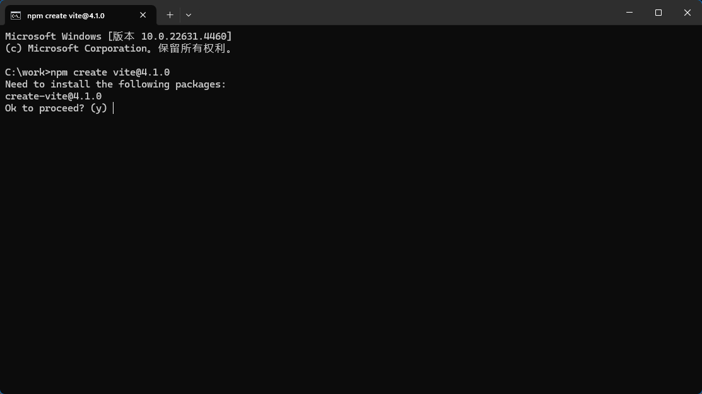

依次选择
y
vite-project
vue
javascript

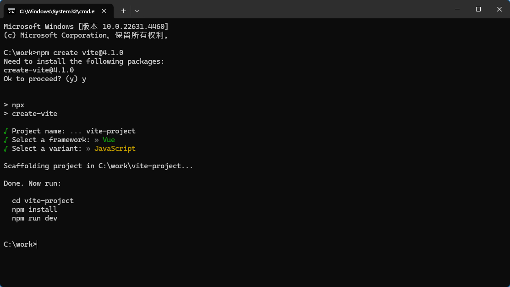

项目创建成功

### 2.启动项目
```
cd vite-project
npm install
npm run dev
```

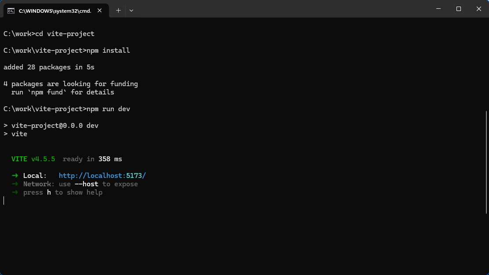

浏览器访问 http://localhost:5173/

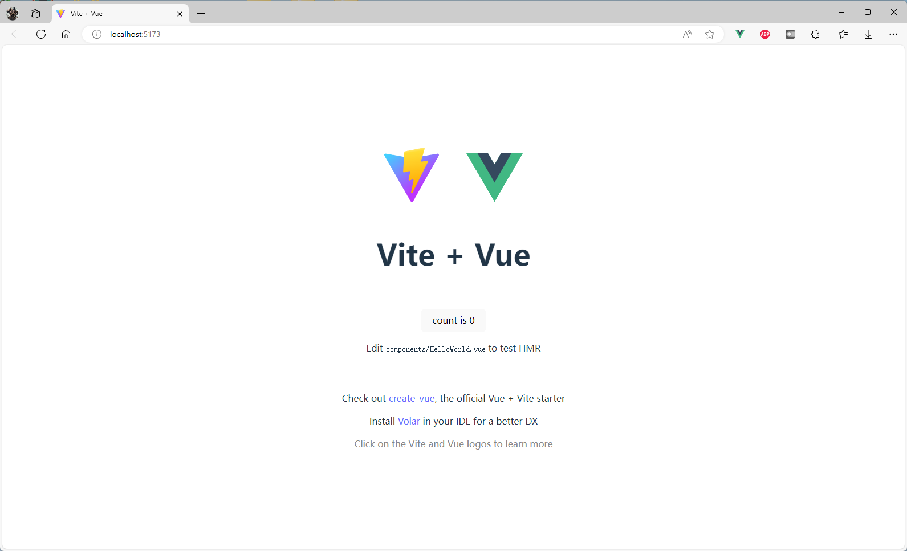

项目启动成功

### 3.安装Vue Router

```
yarn add vue-router@4 --save
```

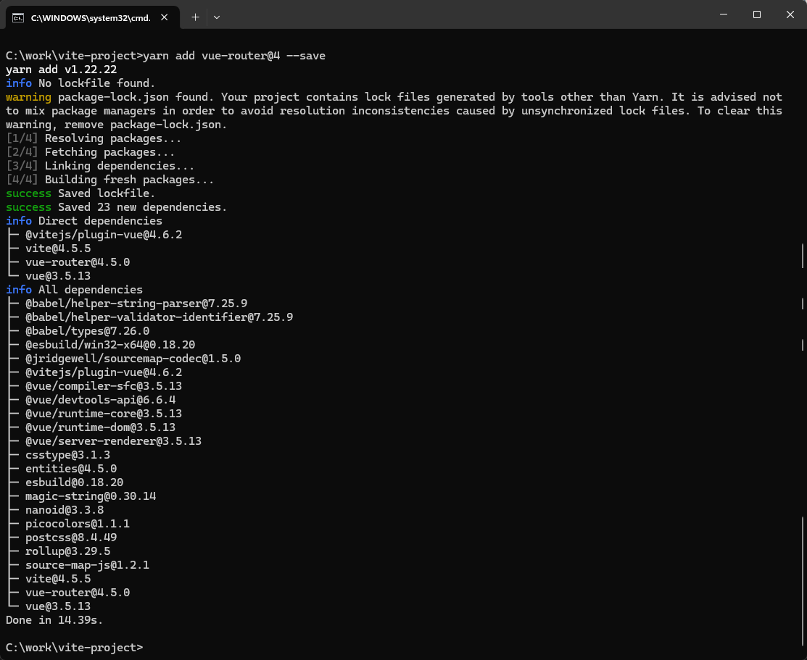

进入src目录，创建router.js文件

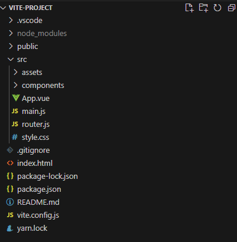

在router.js中添加以下内容
```
import { createRouter, createWebHashHistory } from "vue-router";
const router = createRouter({
history: createWebHashHistory(),
routes: []
})
export default router
```

在main.js中引入router.js
```
import { createApp } from 'vue'
import './style.css'
import App from './App.vue'
import router from './router'
const app = createApp(App)
app.use(router)
app.mount('#app')
```

### 4.安装Less依赖

```
yarn add --save-dev less-loader less
```
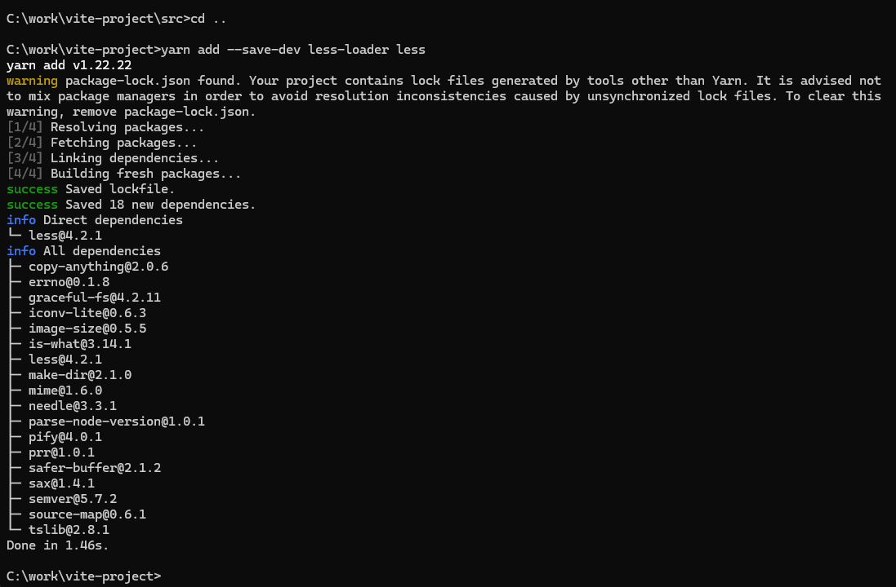

依赖安装成功

## 二、渲染登录组件

### 1.创建登录组件

在src/components目录下创建Login.vue文件

在router.js中添加以下内容

```
routes: [
    { path: '/', redirect:'/login' },
    { path: '/login', component: ()=> import ('./components/Login.vue') },
    ]
```
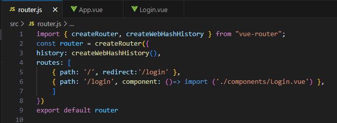

在App.vue中先删除旧内容，再添加以下内容

```
<template>
  <div id="app">
    <router-view></router-view>
  </div>
</template>

<script>
</script>
```
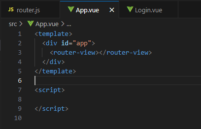

### 2.添加登录功能

在Login.vue中添加以下内容

```
<template>
    <div class="login-container">
        <div class="login-box">
            <!-- 头像部分 -->
            <div class="avatar-box">
                
            </div>
            <!-- 登陆表单部分 -->
            <div class="login-form">
                <div class="form-title">登录</div>
                <div class="form-group">
                    <label for="username">用户名：</label>
                    <input id="username" class="form-control" type="text" autocomplete="off" v-model.trim="username">
                </div>
                <div class="form-group">
                    <label for="password">密码：</label>
                    <input id="password" class="form-control" type="password" autocomplete="off"
                        v-model.trim="password">
                </div>
                <div class="form-grop">
                    <button type="button" class="button" @click="onLogin">登陆</button>
                </div>
            </div>
        </div>
    </div>
</template>

<style scoped lang="less">
.login-container {
    .avatar-box {
        img {
            width: 150px;
            height: 150px;
        }
    }

    .login-form {
        padding: 25px;
        background-color: rgb(255, 252, 247);
        border-radius: 16px;
        border: 1px solid #ccc;
        width: 250px;
        height: 200px;

        .form-title {
            font-size: 24px;
            text-align: center;
            margin-bottom: 20px;
            font-weight: bolder;
        }

        .form-group {
            margin-bottom: 30px;
            text-align: left;
            display: flex;

            label {
                width: 65px;
            }
        }
    }
    .button{
                background-color: #003B8F!important;
                color:#fff;
                font-weight: bold;
                font-size: 14px;
            }
}
</style>

<script setup>
import { ref } from 'vue'
import { useRouter } from 'vue-router'

const username = ref('')
const password = ref('')
const router = useRouter()

// 登录跳转
const onLogin = () => {
    if (username.value === 'admin' && password.value === '123456') {
        router.push({ path: '/home' })
        return localStorage.setItem('token', '123')
    } else {
        alert('用户名或密码错误')
        return localStorage.removeItem('token')
    }
}
</script>
```
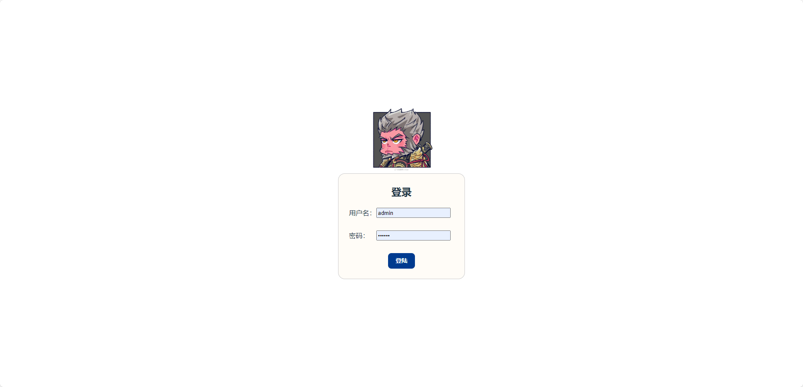

## 三、渲染首页组件

### 1.创建首页组件

在src/components目录下创建Home.vue文件

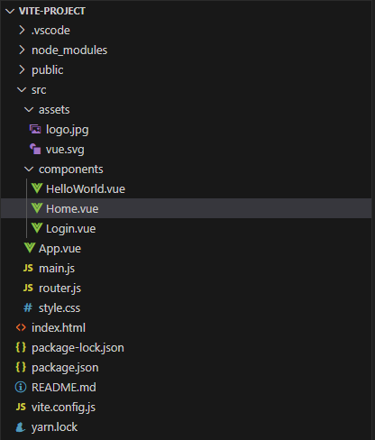

在router.js中添加以下内容
```
routes: [
    { path: '/', redirect:'/login' },
    { path: '/login', component: ()=> import ('./components/Login.vue') },
    { path: '/home', component: ()=> import ('./components/Home.vue') },
    ]
```

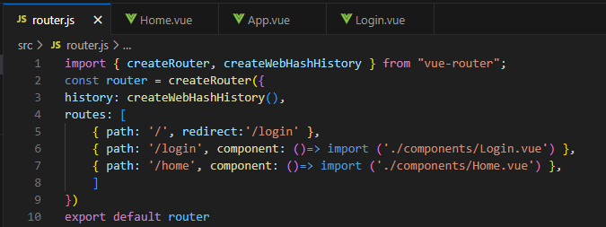

在Home.vue中添加以下内容

```
<template>
    <div class="home-container">
        <!-- 头部部分 -->
         <my-header></my-header>
         <!-- 主体部分 -->
          <div class="home-main">
            <my-aside></my-aside>
            <div class="home-body">
                <!-- 路由视图 -->
                <router-view></router-view>
            </div>
          </div>
    </div>
</template>
<script setup>
// 引入组件
import MyHeader from './subcomponent/Header.vue'
import MyAside from './subcomponent/Aside.vue'
</script>
```

创建文件夹subcomponent，在subcomponent目录下创建Header.vue和Aside.vue文件

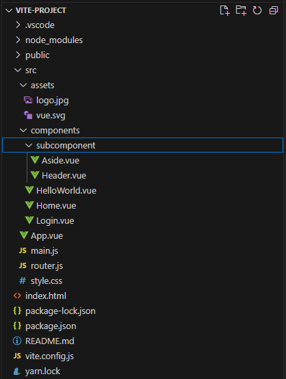

创建