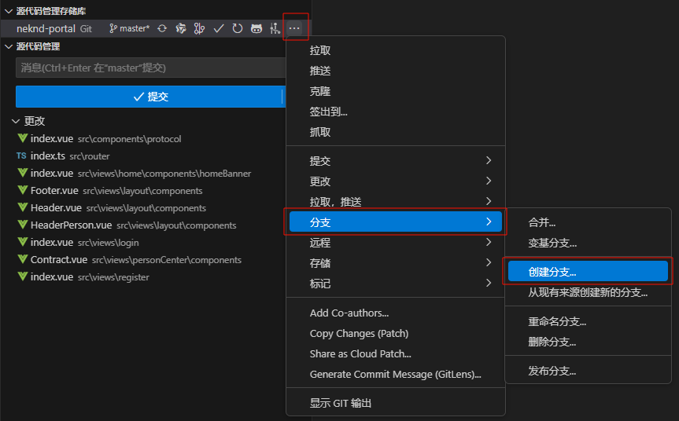
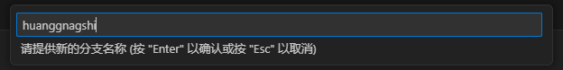
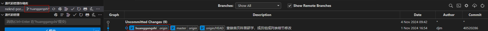
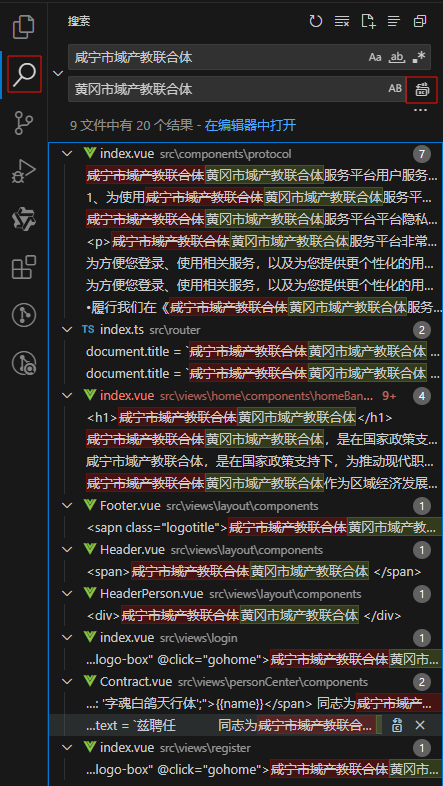
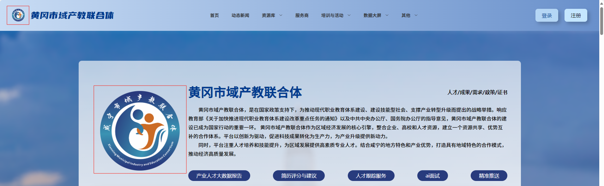
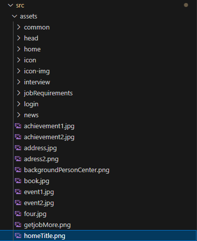
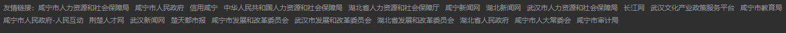
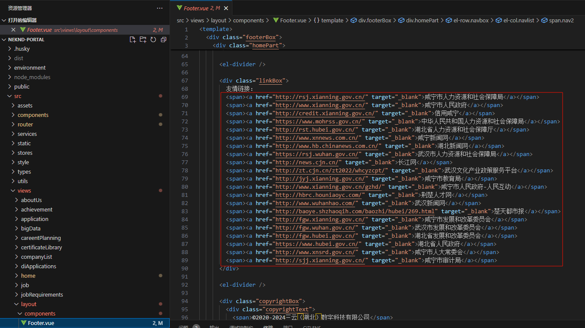

# 程序篇

## 门户网站

### 一、前置条件

1. 已安装门户环境和后台环境
2. 已拉取门户和后台最新代码

### 二、创建新分支

#### 1.切换到master分支

#### 2.重新命名
命名方式：小写拼音字母

例如：黄石市域产教联合体 -> huangshishi 

#### 3.创建成功

### 三、资源文件替换

#### 1.替换文字

#### 2.替换图片

门户位置：

代码位置：neknd-portal\src\assets\homeTitle.png

#### 3.替换链接

门户位置：

代码位置：neknd-portal\src\views\layout\components\Footer.vue

#### 4.替换大屏

## 后台网站

### 一、前置条件

1. 已安装门户环境和后台环境
2. 已拉取门户和后台最新代码

### 二、创建新分支

#### 1.切换到master分支

#### 2.重新命名
命名方式：小写拼音字母

例如：黄石市域产教联合体 -> huangshishi 

#### 3.创建成功

### 三、资源文件替换

#### 1.替换文字

#### 2.替换图片

#### 3.替换数据大屏

