# 运营篇

门户地址：https://www.sycjlht.com/home

## 一、准备工作

下列表格为需要准备的材料和数据

|名称|说明| 数量|举例|备注|
|-|-|-|-|-|
|logo图片|代表该产教联合体的图片|1张|.png>)|没有logo用风景照代替 尽量是1：1的长宽比|
|标题名称|代表该产教联合体的名称|1个|武工职产教融合平台||
|友情链接|与该产教联合体相关的网站|16~20个|[武汉市教育局](https://jyj.wuhan.gov.cn/)|名称和链接都要|
|联系人名称|代表该产教联合体的联系人的姓氏|1个|王女士|只要姓氏就够了|
|联系人电话|代表该产教联合体的联系人的电话号码|1个|19972083105|
|地图图片|该产教联合体的地址地图|1张|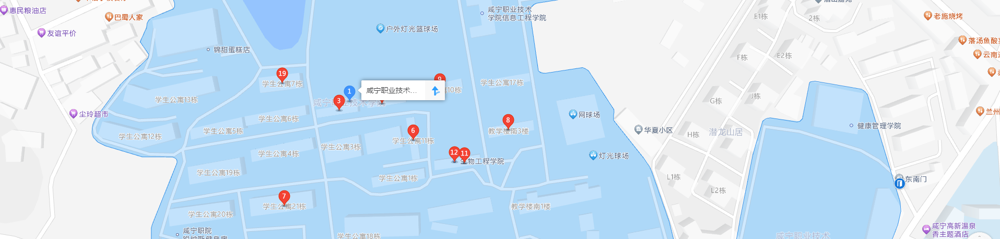|高德地图上去截图 长宽至少是4：:1|
|平台简介文字介绍|放在首页的文字介绍|250字左右|&nbsp;&nbsp;&nbsp;&nbsp;武工职产教融合平台，作为区域经济发展的核心引擎，整合了企业、高校及人才的优质资源，构建起紧密协作、互利共赢的合作体系。该联合体秉持资源共享原则，确保每项资源得以最大化利用；强调优势互补，深度挖掘合作潜能，共同开创双赢新局面。平台深入探索产教融合路径，以创新驱动为核心战略，加速科技成果向现实生产力转化，为产业升级注入源源不断的新动能。 &nbsp;&nbsp;&nbsp;&nbsp;同时，武工职产教融合平台致力于人才培养与技能提升，为区域发展持续输送高素质专业人才。结合新区独特的地方特色与产业优势，打造具有鲜明地域特征的合作模式，引领区域经济迈向高质量发展的崭新阶段。|2段式|
|关于我们文字介绍|放在关于我们页面的文字介绍|600字左右|市域产教联合体，作为教育部部署的教育工作重点项目，旨在加速职业教育与产业融合，构建现代教育体系，促进区域经济发展。该平台以“12345”战略为指引，围绕产教融合核心，构建综合服务平台，促进信息共享与技术交流。 平台广泛联合教育机构、企业、政府三方力量，形成强大合作网络，集合人才信息供需匹配、技术服务输出、信息资源共享、数据分析决策四大功能于一身。平台内设五大核心板块：人才库汇聚专业精英，成果库展示创新硕果，需求库实现市场精准对接，政策库整合政策信息，证书库展示各类专业证书信息。 市域产教联合体通过这些功能板块的紧密协作，高效对接专业人才与企业需求，促进资源优化配置与产能共享，为企业提供全方位服务支持。同时，平台利用数据分析洞察区域产业发展趋势，进一步推动校企合作深化，激活地方产业发展潜力。||一大段|

## 二、“首页” 页面替换

### 1.替换logo图片（3处）

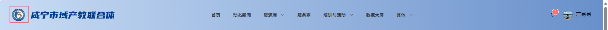

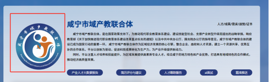

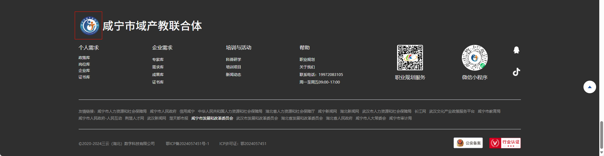

### 2.替换标题名称（3处）

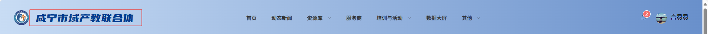

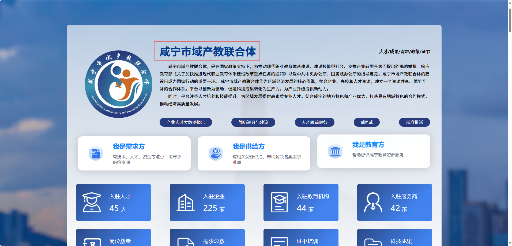

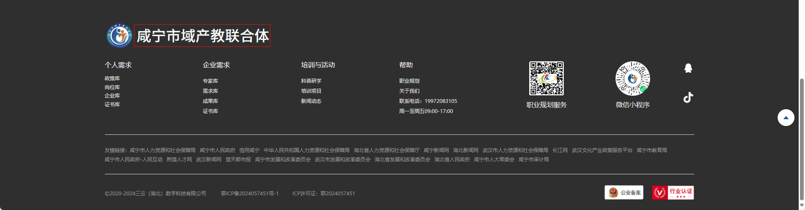

### 3.替换首页文字介绍（1处）

### 4.替换联系人电话（1处）

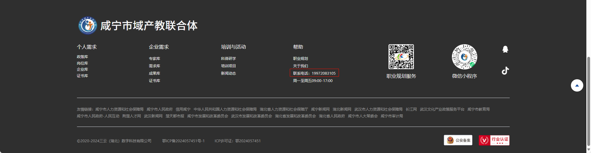

### 5.替换友情链接（1处）

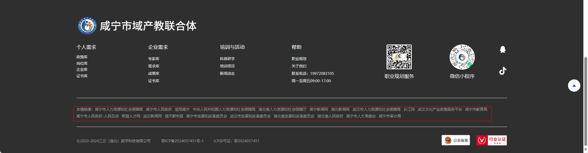

## 三、“关于我们” 页面替换

页面位置：
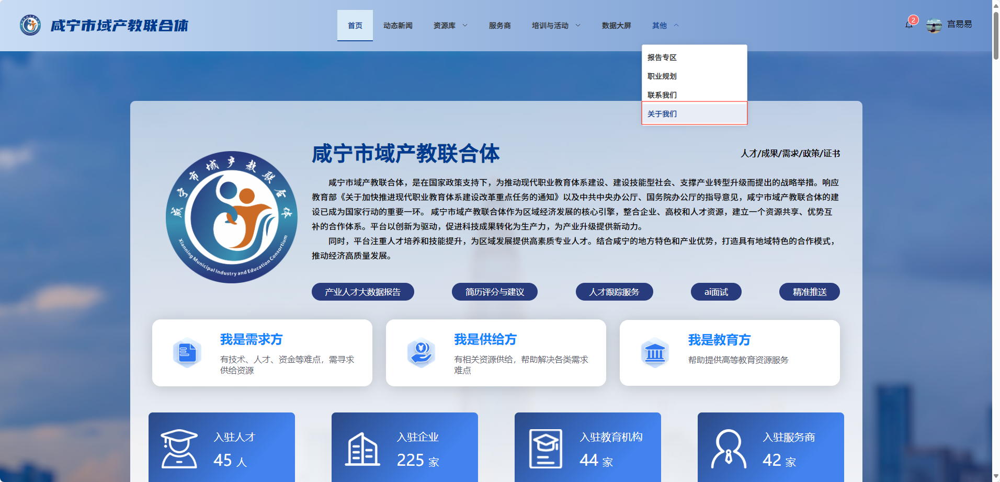

### 1.替换文字介绍（1处）

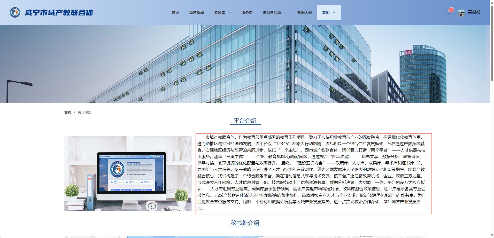

### 2.替换地图图片（1处）

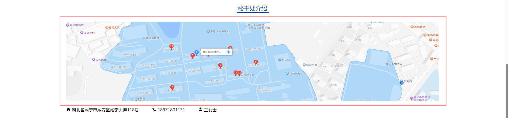

### 3.替换地址（1处）

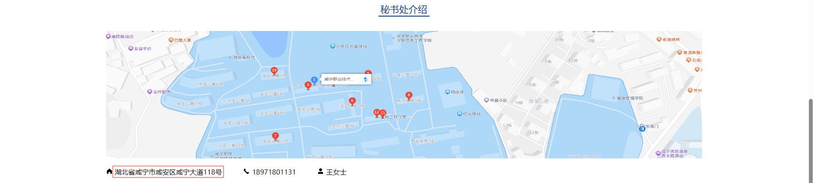

### 4.替换联系人电话（1处）

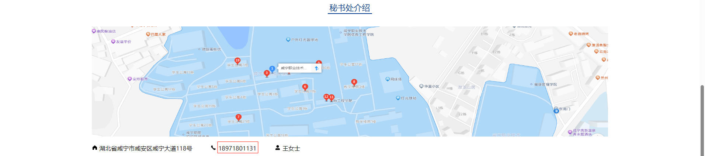

### 5.替换联系人名称（1处）

