# 初级阶段

## 一、初识

### 1.职业发展

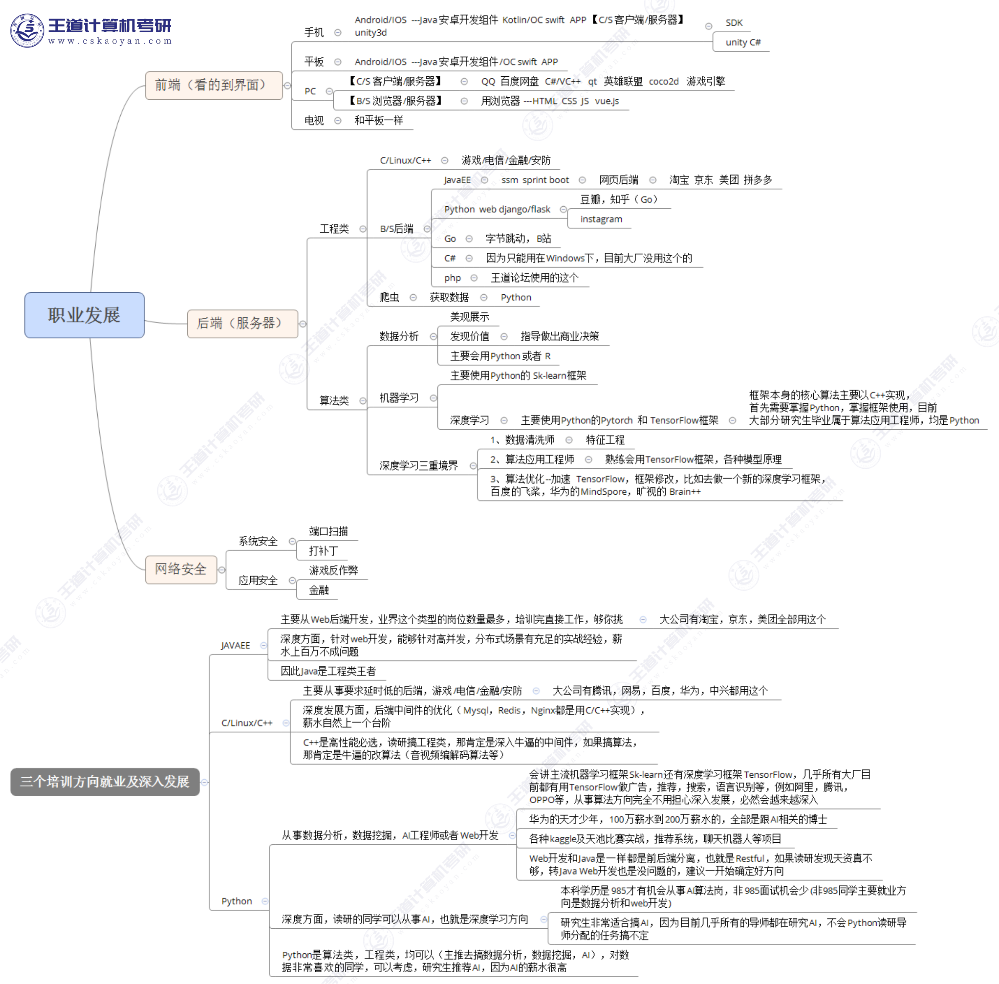

### 2.Windows开发环境

#### clion


#### vscode


#### dev c++


#### codeBlocks


### 3.编译调试

#### 程序作用是什么

完成某种计算

#### 新建和编译

<!-- 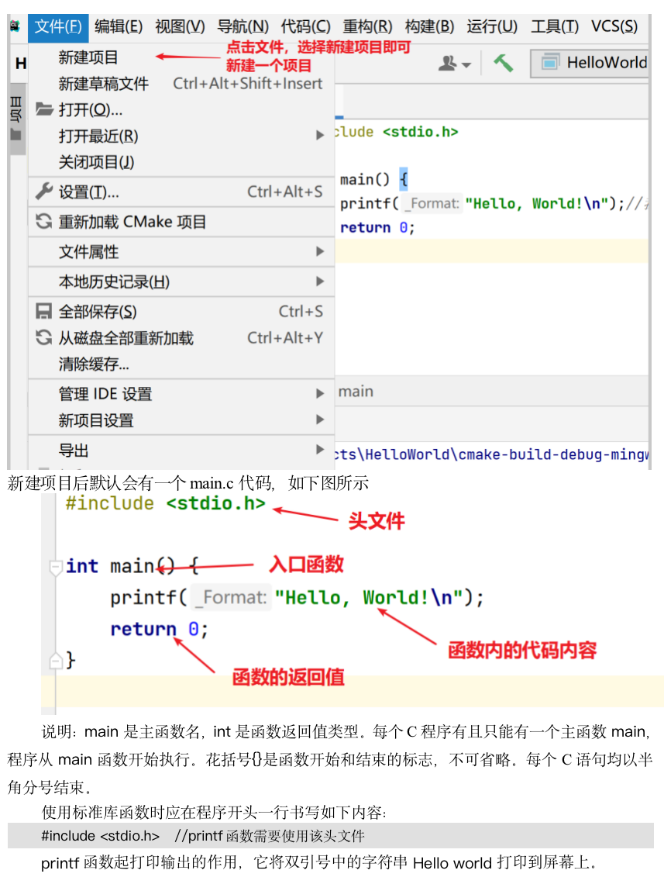 -->

#### 编译过程和项目位置
<!-- 
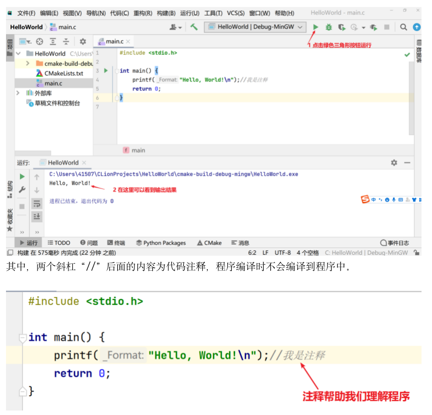

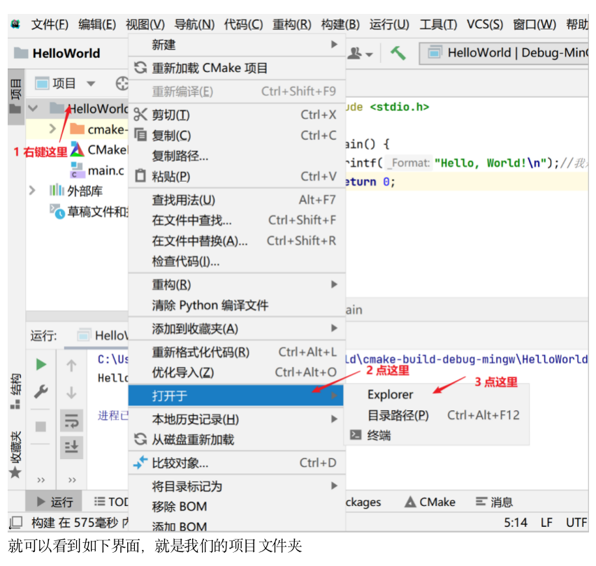 -->

#### 断点调试
<!-- 
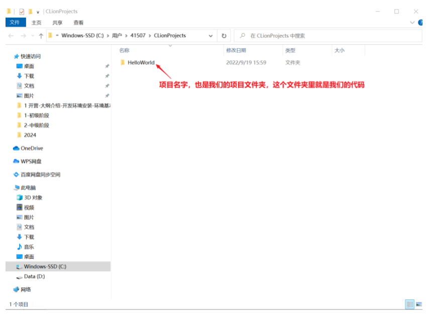


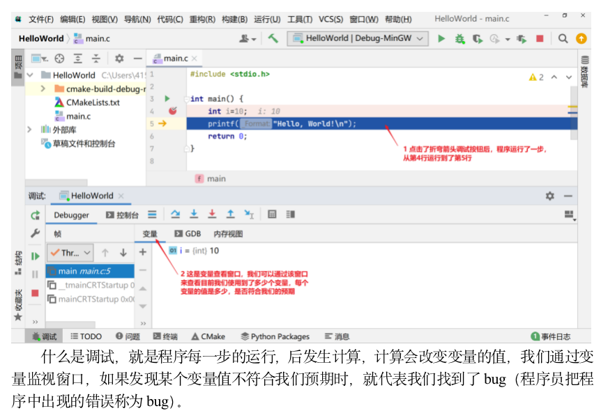 -->

## 二、数据类型、输入输出

### 1.数据类型

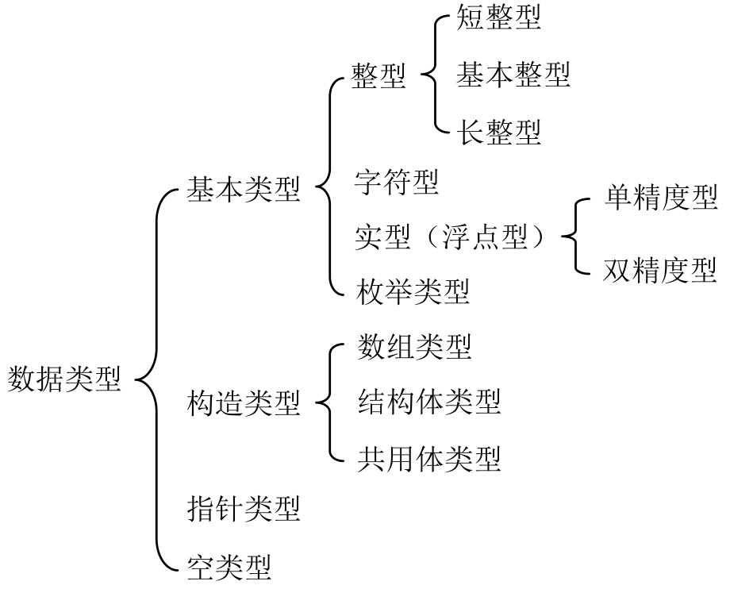

#### 关键字

c语言提前起好的名字

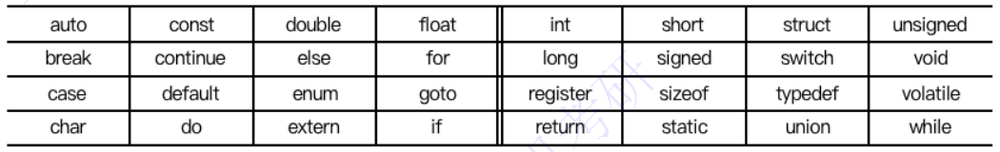

#### 标识符

自己重新命名的名字

#### 常量

运行过程中不会发生改变的量

#### 变量

 运行过程中可以发生改变的量

> 字母、数字、下划线命名，数字不为首
>
> 见名知意，不与关键字重名

### 2.整型

#### 符号常量

用一个符号代替一个常量

`#define 标识符 常量`

> 不用分号结尾
>
> 先定义，再使用
>
> 直接替换，一改全改

#### 整型变量

`int 变量名`

> 四个字节

### 3.浮点型

#### 浮点常量

带小数的常量

小数形式：0.123

指数形式：1e3、-.1e-3

#### 浮点变量

`float 变量名`

> 四个字节

### 4.字符型

#### 字符常量

不好直接敲出来的字符或者动作，单引号括起来

`'字符常量'`

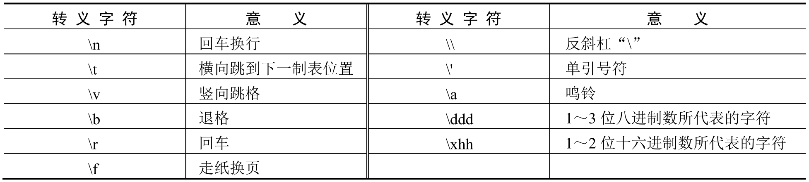

| 转义字符 | 作用   |
| -------- | ------ |
| ` \n`    | 换行   |
| ` \b`    | 退格   |
| ` \\`    | 反斜杠 |

> 一个字节

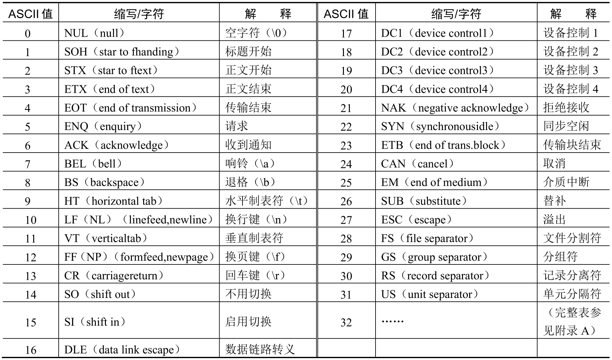

### 5.混合运算

#### 强制类型转换

整数除法结果是小数时

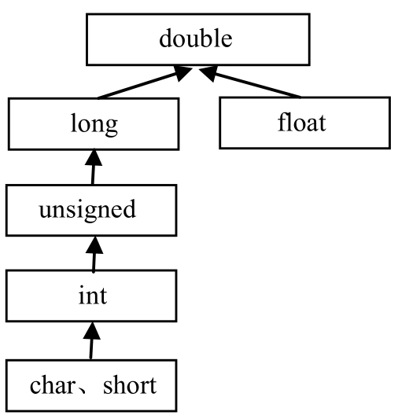

#### printf

输出到屏幕，默认右对齐

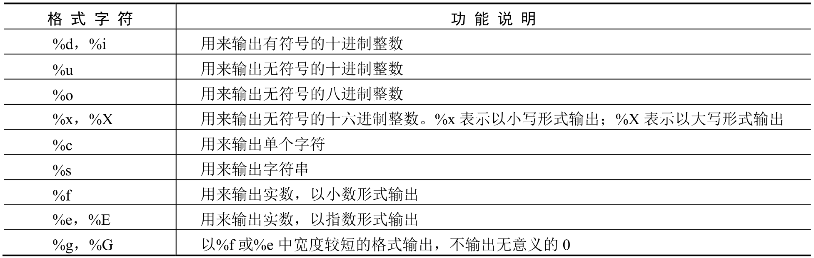


| 格式         | 说明           |
| :----------- | -------------- |
| `%c`         | 字符           |
| `%d`         | 带符号整数     |
| `%f`         | 浮点数         |
| `%s`         | 字符串         |
| `%u`         | 无符号整数     |
| `%x`或者`%X` | 无符号十六进制 |
| `%o`或者`%O` | 无符号八进制   |
| `%p`         | 指针           |
| `%%`         | %              |

`%5.2f`保留五位，小数点后两位 

```c

```

#### scnaf

读取键盘输入的值

`scanf(" ",& )`

```c
#include <stdio.h>
//混合输出
int main() {
    int i,ref;
    float f;
    char c;
    ref= scanf("%d %c %f",&i,&c,&f);//ref匹配成功个数
    printf("i=%d,c=%c,f=%f\n",i,c,f);
    return 0;
}
```

## 三、运算符表达式

## 1.算数运算符

## 2.关系运算符

## 3.逻辑运算符

## 4.位运算符

## 5.赋值运算符


## 四、选择和循环

## 五、数组

## 六、指针

## 七、函数

## 八、结构体

# 中级阶段

# 高级阶段

# 实战

## 一、入门

### 输出hello world

```c
#include <stdio.h>
int main()
{
	printf("Hello World!");
	return 0;
}
```

## 二、语法

### 1.定义符号常量

```c
#include <stdio.h>
#define PI 3+2
int main() {
    int a = PI*2;
    int b = 3+2*2;
    printf("%d\n%d",a,b); //二者结果相等为7
    return 0;
}
```

### 2.强制类型转换

```
#include <stdio.h>
int main() {
    int i= 5;
    float f= (float)i/2;
    printf("%f\n",f);
    return 0;
}
```


```c
#include <stdio.h>
//printf输出
int main() {
    int a = 10;
    float b = 96.1;
    printf("number = %d,score = %5.2f\n",a,b);
    return 0;
}
```

